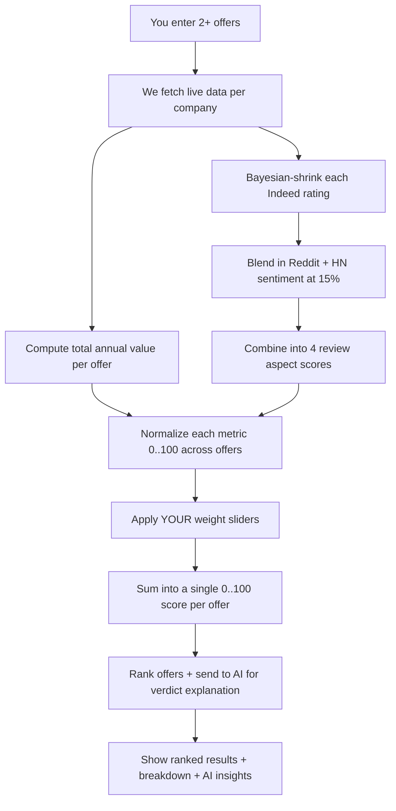

# How Job Offer Compare Works

> **Plain-English explainer of how this tool turns 2-4 job offers into a
> single ranked recommendation. Designed for non-technical readers \u2014 if
> something here is confusing, that's a bug.**

---

## The 30-second version

You enter your offers (salary, equity, sign-on, etc.). The tool fetches
real data about each company (stock prices, Indeed ratings, Reddit chatter).
It then computes a personalized score using **weights that you control** \u2014
because "what's a good offer?" is not the same answer for everyone.

Output: a ranked list of offers, an AI-generated explanation of why one
wins, and a per-metric breakdown so you can see exactly *why* the math came
out that way.

---

## What goes in (your inputs)

For each offer, you tell us:

| Category | Fields | Where they come from |
|---|---|---|
| **Identity** | Company, job title, level, location | You |
| **Compensation** | Base salary, target bonus %, sign-on bonus, equity (per year), benefits value | You (from the offer letter) |
| **Lifestyle** | Work mode (Remote/Hybrid/Onsite), commute cost | You |
| **Personal fit** | "Career growth / fit" (0-100 slider) | Your gut feeling |
| **Currency** | INR by default; FX conversion if you enter USD/GBP/etc. | You pick |

That's it. ~10 numbers per offer. Takes 5 minutes.

---

## What we look up automatically (no input needed)

For each company you mention, the tool quietly fetches:

| Data | Source | Purpose | How fresh |
|---|---|---|---|
| **Stock price history** | Yahoo Finance | Compute 5-year & 1-year stock CAGR \u2192 estimate equity growth | Refreshed every 6 hours |
| **Indeed rating + 5 sub-ratings** | Indeed (via Google Gemini AI) | Real employee reviews of pay, work-life balance, management, culture, job security | Refreshed monthly per company |
| **Reddit chatter** | r/cscareerquestions, r/IndianWorkplace, etc. | Real-time sentiment about working at the company | Refreshed weekly |
| **Hacker News mentions** | HN comments | Tech-community sentiment | Refreshed weekly |
| **FX rates** | European Central Bank (Frankfurter API) | Convert non-INR offers to INR | Refreshed daily |

**Important:** if any of these can't be fetched, we say "no data available"
\u2014 we never invent a number to fill the gap. (See the **trust rules**
section below.)

---

## How a score is calculated \u2014 the simple flow



Let's walk through each step in plain language.

---

## Step 1: Per-offer "total annual value" (\u20b9/year)

We compute one number that represents the **dollar value** of the offer in
year 1:

```
total = base salary
      + annual bonus               (= base \u00d7 target%)
      + equity vesting this year   (with stock-growth multiplier)
      + sign-on bonus              (full amount in year 1)
      + benefits value
      \u2212 commute cost
```

Real example for a hypothetical Microsoft offer:

| Component | Value |
|---|---|
| Base salary | \u20b930L |
| Annual bonus | \u20b94.5L (15% of base) |
| Equity vesting year 1 | \u20b912L (stated) \u00d7 1.11 (5y CAGR boost) = **\u20b913.3L** |
| Sign-on (year 1) | \u20b95L |
| Benefits | \u20b92L |
| Commute (Remote) | \u20b90 |
| **Total year-1 value** | **\u20b954.8L** |

This is the **headline number** you see for each offer.

---

## Step 2: Per-offer review score (out of 5\u2605)

We pull Indeed ratings and combine them honestly:

### 2a. Bayesian shrinkage (the "trust me, I have 3 reviews" defense)

A startup with 5\u2605 average from 20 reviews **shouldn't** beat a giant
with 4.2\u2605 from 50,000 reviews. We apply Bayesian shrinkage to pull
small-sample ratings toward the global average (3.7\u2605):

```
shrunk_rating = (rating \u00d7 reviews + 3.7 \u00d7 100) / (reviews + 100)
```

Effect:
- Big company (Adobe, 869 reviews, 4.2\u2605) \u2192 stays 4.15\u2605 (barely
  moves)
- Tiny startup (20 reviews, 5.0\u2605) \u2192 becomes 3.92\u2605 (heavily
  pulled down)

This protects you from being seduced by cherry-picked startup reviews.

### 2b. Sentiment blend (15%)

We mix in real-time chatter from Reddit + Hacker News:

```
final_aspect = shrunk_rating \u00d7 0.85 + sentiment_score \u00d7 0.15
```

So a company with great Indeed ratings but terrible recent Reddit threads
about layoffs will score slightly lower than its star rating alone suggests.

### 2c. Four aspects per company

We compute 4 weighted sub-scores from Indeed:

| Aspect | Indeed source field |
|---|---|
| Comp & Benefits | Indeed "Compensation/Benefits" |
| Work-Life Balance | Indeed "Work-life balance" |
| Culture | Indeed "Culture" |
| Management | Indeed "Management" |

If a sub-rating is missing for a company, we fall back to the overall
rating \u2014 not the global mean.

---

## Step 3: You choose what matters (the weight sliders)

In the comparison wizard, you have sliders for each metric (0-10 importance):

| Metric | What it measures |
|---|---|
| Base salary | Your monthly check |
| Annual bonus | Recurring on-target bonus |
| Equity | Stock vesting (with growth) |
| Sign-on (year 1) | One-time payment |
| Benefits | Insurance, perks, ESOPs |
| Work mode | Remote = 100, Hybrid = 60, Onsite = 30 |
| Career growth / fit | Your subjective rating |
| Reviews \u00b7 Comp & Benefits | What employees say about pay |
| Reviews \u00b7 Work-Life Balance | What employees say about WLB |
| Reviews \u00b7 Culture | What employees say about culture |
| Reviews \u00b7 Management | What employees say about management |

**The weights are the secret sauce.** A new grad wants a different score
than a senior IC who is comp-saturated and just wants WLB.

---

## Step 4: Normalize, weight, and sum

For each metric:

1. **Normalize** the raw values to 0..100 across the offers being compared:
   ```
   normalized[offer] = (value[offer] / max value across offers) \u00d7 100
   ```
   The best-on-this-metric offer scores 100. Others get proportional credit.

2. **Apply your weight**:
   ```
   contribution[metric] = normalized \u00d7 weight / 100
   ```

3. **Sum** across all metrics for each offer:
   ```
   total_score = sum of all contributions
   ```

The result: a single number 0..100 per offer. Highest wins.

---

## Step 5: AI-generated verdict (Azure OpenAI gpt-4.1-mini)

We send the ranked snapshot to an AI model and ask for 4 things:

| Insight | What the AI is asked |
|---|---|
| **Verdict** | "Why does offer #1 win?" \u2014 cites real numbers from the snapshot |
| **Trade-offs** | "What does the user give up by picking the winner?" |
| **Negotiation talking points** | "If user asked the loser to match the winner, what 3 specific asks would close the gap?" |
| **Recruiter questions** | "Smart questions to ask each company" |

The AI is **prompted** to never invent numbers \u2014 it can only cite
values from the JSON snapshot we send it. Each insight is cached per
comparison so you don't pay tokens twice for the same comparison.

---

## How we earn your trust (the 5 hard rules)

These are baked into the code. If we ever break one, treat it as a bug.

### Rule 1: Source-or-null

Every external rating is stored alongside the URL it came from. **If we
couldn't fetch a real source, the value is `null` and the UI shows "no
data" instead of guessing.**

Example: if Indeed has no page for a small startup, the company shows
"Indeed: not available" rather than an invented 3.7\u2605.

### Rule 2: Bayesian shrinkage on small samples

Already explained above. Tiny-sample ratings get pulled toward the global
mean so they can't dominate. Mathematically prevents the "20 fake reviews"
attack.

### Rule 3: Live, source-cited refresh

Indeed ratings are fetched via Gemini-grounded web search and stored with
their citation URL. Refreshes happen on a daily rotating schedule so
every company is updated within ~30 days.

### Rule 4: Stock CAGR from real prices

Equity isn't a hypothetical. We pull actual closing prices from Yahoo
Finance, compute 5y and 1y CAGR, and let you pick which to apply.

### Rule 5: AI that quotes the data

Verdicts are generated from the same JSON snapshot you can see in the
table below. Prompts forbid inventing numbers. The snapshot is shown next
to the AI output so you can verify nothing was made up.

---

## What's deliberately NOT in the score

| Excluded | Why |
|---|---|
| **Cost-of-living adjustment** | The free indices (Numbeo, etc.) are too unreliable to bake into scoring. v2. |
| **Layoff history** | Backward-looking and noisy; correlates poorly with future job security. Shown on company page as informational only. |
| **Glassdoor / Blind ratings** | Glassdoor is behind aggressive Cloudflare protection; reliable extraction failed. We use Indeed as the single source of truth. |
| **CEO Approval %** | Highly correlated with overall rating already \u2014 weighting it again is double-counting. |

---

## What if data is missing?

Real, common situations and what happens:

| Scenario | What we do |
|---|---|
| Indeed has no page for a small startup | Reviews score = `null`. Reviews-related metrics get a 0 weight (they're literally "no signal"). Other metrics still compute. |
| Stock CAGR can't be fetched (private company) | Equity uses your raw input with growth multiplier = 1 (no boost, no penalty). |
| Reddit + HN have zero mentions | Sentiment blend skipped. Pure star rating used. |
| You enter offers in 3 different currencies | We FX-convert all to INR internally for comparison; show original currency in the UI. |

---

## End-to-end example

You're comparing **Microsoft \u20b9 30L base** vs **Razorpay \u20b9 35L
base**.

```
Step 1: Total annual value
  Microsoft = 30 + 4.5 + 13.3 + 5 + 2 = \u20b954.8L
  Razorpay  = 35 + 7   + 8    + 3 + 1.5 = \u20b954.5L

Step 2: Reviews (Microsoft 4.2\u2605, Razorpay 3.6\u2605 \u2014 hypothetical)
  Microsoft Indeed reviews are positive on WLB, mid on Comp
  Razorpay Indeed reviews are mid on WLB, high on Comp

Step 3: You set weights
  Salary: 8 (you care about base)
  WLB: 9 (you really care about WLB)
  Equity: 5
  Reviews \u00b7 Culture: 6
  ... etc

Step 4: Normalize + weight + sum
  Total = sum of (normalized_metric \u00d7 your_weight) per offer

Step 5: Result
  Microsoft 78.4 \u00b7 Razorpay 71.2 \u2192 Microsoft wins
  AI verdict: "Microsoft wins on Reviews \u00b7 WLB (4.0\u2605 vs 3.4\u2605)
   and Equity (with 10.94% historical CAGR boost), enough to overcome
   Razorpay's \u20b95L base salary lead. Trade-off: Razorpay pays \u20b95L
   more base today; if you'd take the cash over WLB, flip your sliders."
```

---

## A note on what AI does and doesn't do here

We use AI in two places, and they're very different:

| Use | What's at stake | How we constrain it |
|---|---|---|
| **Fetching Indeed ratings** | Could hallucinate fake numbers | Strict JSON validation + reject any value without a verifiable source URL |
| **Generating the verdict text** | Could mislead with prose | Forced to cite numbers from the snapshot; can't invent figures |

The AI never decides which offer wins. **You do**, through your weight
sliders. The AI just narrates what the math already said.

---

## Open about the limits

A few honest things:

- **First-time data coverage is incomplete.** Glassdoor/Indeed scraping is
  hard. About 20-40% of niche companies have no Indeed presence; we say
  so plainly rather than fake it.
- **The Bayesian prior (3.7\u2605) is a single global average.** A more
  precise model would use industry-specific or country-specific priors.
  Listed as v1.5 improvement.
- **Comparing across years requires consistent data freshness.** A
  comparison made today against a snapshot from 2 months ago will show
  slightly stale ratings on the older comparison. Each comparison uses the
  data that was live when it was created.
- **AI insights are reproducible if you regenerate them, but the same
  prompt can give slightly different prose each time.** That's a feature
  of language models, not a bug we'll fix.

---

## How to verify any number you see

For any rating, click into the company page. Every external value has a
**source URL** you can click. We're not asking you to trust us \u2014
we're showing our work.

For any score, click into the comparison's "Detailed breakdown" table.
Every metric shows the raw value, the normalized 0..100 score, and the
weight you assigned. Math is fully transparent.

That's the whole product. No magic. Just clear inputs, real data, honest
math, and your weights driving the answer.
